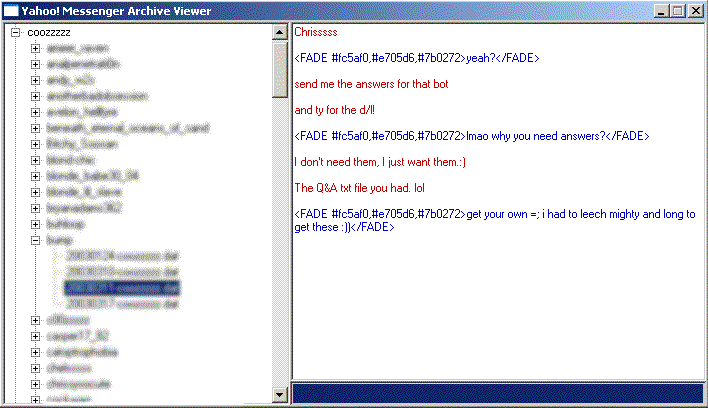



## Yahoo\! Messenger Message Archive Viewer

### Description

View Yahoo! Messenger Message Archives offline (whether yours or not) by processing the *.dat files and XOR'ing the message with the username it was created with.
 
### More Info
 

             |
---                |---
**Submitted On**   |2002-01-03 09:14:00
**By**             |[coozzzzz](https://github.com/Planet-Source-Code/PSCIndex/blob/master/ByAuthor/coozzzzz.md)
**Level**          |Intermediate
**User Rating**    |5.0 (20 globes from 4 users)
**Compatibility**  |VB 6\.0
**Category**       |[Complete Applications](https://github.com/Planet-Source-Code/PSCIndex/blob/master/ByCategory/complete-applications__1-27.md)
**World**          |[Visual Basic](https://github.com/Planet-Source-Code/PSCIndex/blob/master/ByWorld/visual-basic.md)
**Archive File**   |[Yahoo\!\_Mes16823012102003\.zip](https://github.com/Planet-Source-Code/coozzzzz-yahoo-messenger-message-archive-viewer__1-50397/archive/master.zip)

